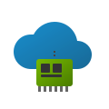

<p align="center">
  
</p>

<h1 align="center">Nextcloud Memories GPU Transcoding</h1>

<p align="center">
  <strong>Offload Memories video transcoding from your storage server to a separate GPU machine.</strong>
</p>

<p align="center">
  <a href="#quick-start">Quick start</a> ·
  <a href="#how-it-works">How it works</a> ·
  <a href="docs/troubleshooting.md">Troubleshooting</a> ·
  <a href="docs/configuration.md">Configuration</a>
</p>

<p align="center">
  
  
  
  <a href="https://paypal.me/jimnoneill"></a>
</p>

---

## Why

Nextcloud Memories transcodes every video on the fly when someone opens it in
a browser. Without a GPU, that work lands on your storage server's CPU and
turns a photo-library app into a sustained all-cores workload. If you already
own a separate machine with an NVIDIA card (a gaming desktop, a repurposed
mining rig, an older workstation), it can take that transcoding load off the
storage box.

This repo is a deploy script plus documentation. It sets up an NFS mount from
storage to GPU host, runs `go-vod` with NVENC on the GPU side, and flips the
right Nextcloud config keys so Memories uses the external transcoder.

```
  STORAGE SERVER                              GPU SERVER
  Nextcloud + Memories  --  NFS (read-only) -->  NVIDIA GPU running go-vod
                        <-- HLS segments    --       with NVENC
```

## Quick start

You need two Ubuntu 22.04+ machines. The storage box is the one running
Nextcloud. The GPU box has an NVIDIA card (GTX 1000 or newer) with driver
525 or later, Docker, and the NVIDIA Container Toolkit installed.

Clone and configure on either machine:

```bash
git clone https://github.com/jimnoneill/nextcloud-memories-gpu
cd nextcloud-memories-gpu
cp .env.example .env
```

Edit `.env` with the four required values:

```bash
STORAGE_IP=192.168.1.10       # your Nextcloud server
GPU_IP=192.168.1.20           # your GPU machine
NEXTCLOUD_DATA=/mnt/data      # path to Nextcloud data on the storage box
DOMAIN=cloud.example.com      # your Nextcloud domain
```

Then run three commands, one per machine:

```bash
./deploy.sh storage     # on the storage server (needs sudo)
./deploy.sh gpu         # on the GPU server
./deploy.sh nextcloud   # on the storage server again
```

After the `nextcloud` step finishes there is one click you have to do by
hand. Open `Admin Settings -> Memories -> Video Streaming`, scroll to
`HW Acceleration`, and turn on **"GOP size workaround"**. Without this,
every video plays for about five seconds and then stops dead. Nobody is
sure why the GOP workaround is off by default.

Verify the install:

```bash
./deploy.sh status
```

Play a video in Memories and confirm the GPU is doing work:

```bash
ssh gpu-server 'nvidia-smi'
```

## How it works

When a user opens a video in Memories, Nextcloud forwards the transcode
request over HTTP to `go-vod` on the GPU server, port 47788. `go-vod`
reads the source file directly over the NFS mount, pushes it through
NVENC hardware encoding, and streams the resulting HLS segments back
through Nextcloud to the browser. The storage server never touches the
video data. You get smooth 1080p and 4K playback without the CPU pegging
in `htop` every time someone scrolls through their photo library.

## Commands

All five live under `deploy.sh`:

```bash
./deploy.sh storage     # set up NFS exports on the storage box
./deploy.sh gpu         # pull and launch the go-vod container
./deploy.sh nextcloud   # flip the Memories/OCC config keys
./deploy.sh status      # verify everything is wired up correctly
./deploy.sh logs        # tail go-vod output from the GPU box
./deploy.sh version     # print the current version
./deploy.sh help        # show all commands
```

## Documentation

Settings reference lives in [docs/configuration.md](docs/configuration.md).
Common failure modes and their fixes are in
[docs/troubleshooting.md](docs/troubleshooting.md). If you'd rather install
by hand instead of running the script, [docs/manual-setup.md](docs/manual-setup.md)
walks through the same steps explicitly. The Nextcloud admin panel bits
are covered in [docs/admin-ui.md](docs/admin-ui.md). The maintainer-side
SemVer release process is in [docs/releasing.md](docs/releasing.md), and
the version history is in [CHANGELOG.md](CHANGELOG.md).

## When something goes wrong

| Symptom | Likely cause |
|---|---|
| Video plays for 5 seconds then stops | GOP workaround still off in admin |
| Nextcloud says "Previews disabled" | Re-run `./deploy.sh nextcloud` |
| 408 timeout on longer videos | PHP or nginx timeout too low |
| Video works but GPU is idle | NVIDIA Container Toolkit not installed |

Full writeups with the actual fix for each in
[docs/troubleshooting.md](docs/troubleshooting.md).

## Requirements

Memories 7.0+, go-vod 0.2.6+, NVIDIA driver 525+. CUDA 11 ships inside the
`go-vod` image, so you don't need it installed on the host.

## Support

If this saved you a weekend of debugging your storage server's CPU load,
contributions toward continued maintenance are welcome.

<p>
  <a href="https://paypal.me/jimnoneill"></a>
</p>

## License

MIT, 2026.
